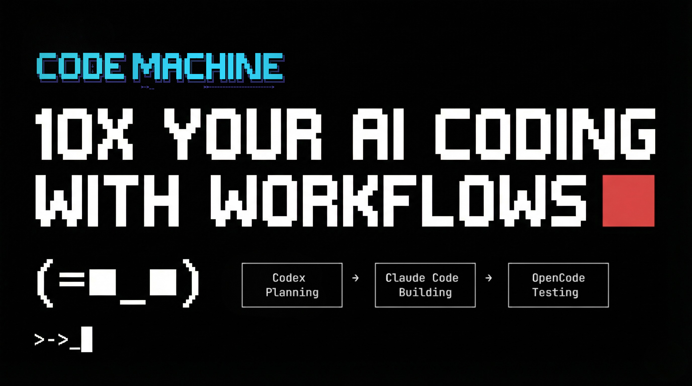

# Ali Narrator TUI

A terminal-based narrator interface featuring Ali, the CodeMachine explainer character. Ali types out text with a typing animation inside an ASCII art frame, with support for face expressions, timed pauses, and multi-line scripts.

This is used to create video content - record the terminal running a narrate script and you get a ready-to-use explainer clip.

[](https://www.youtube.com/watch?v=G7OTG9iSvYw)

## Requirements

- [Bun](https://bun.sh) runtime

## Setup

```bash
bun install
```

## Commands

### `say` - Quick single-line narration

```bash
bun run dev -- say "Hello world"
```

Options:

| Flag | Description | Default |
|------|-------------|---------|
| `-f, --face <expression>` | Starting face expression | `idle` |
| `-d, --delay <seconds>` | Seconds to wait after text completes | `2` |
| `-s, --speed <ms>` | Milliseconds per character | `30` |

The text supports inline markup:

- `{N}` - pause for N seconds mid-sentence
- `[face]` - change face expression inline

```bash
bun run dev -- say "Hi {1} [thinking] Let me think about that..." --face idle --delay 3
```

### `narrate` - Play a script file

```bash
bun run dev -- narrate script.txt
```

Options:

| Flag | Description | Default |
|------|-------------|---------|
| `-s, --speed <ms>` | Milliseconds per character | `30` |

## Script format

Each line follows the format:

```
face|delay: text content here
```

- **face** - starting face expression for the line (e.g. `idle`, `thinking`)
- **delay** - seconds to wait after the line finishes typing
- **text** - content with optional `{N}` pauses and `[face]` expression changes

Lines starting with `#` are comments. Empty lines are skipped.

### Example script

```
# intro.txt
idle|3: Hi, {2} I am Ali {1} [thinking] your codemachine explainer
thinking|2: Let me explain how this works...
idle|1: Pretty cool, right?
```

Run it:

```bash
bun run dev -- narrate intro.txt
```

## Example output

Running `bun run dev -- say "Hello world"` renders a centered frame in the terminal:

```
 ╭─
 │  (⌐■_■)    Ali | The CM Guy
 │  ↳ Hello world_
 ╰─
```

With face changes, `bun run dev -- say "Hi {1} [thinking] Let me think..." --face idle`:

```
 ╭─
 │  (╭ರ_•́)    Ali | The CM Guy
 │  ↳ Hi  Let me think..._
 ╰─
```

The text types out character by character. `{1}` inserts a 1-second pause mid-sentence, and `[thinking]` switches the face from `(⌐■_■)` to `(╭ರ_•́)`.

### Available faces

| Name | Face |
|------|------|
| `idle` | `(⌐■_■)` |
| `thinking` | `(╭ರ_•́)` |
| `tool` | `<(•_•<)` |
| `error` | `(╥﹏╥)` |
| `excited` | `(ノ◕ヮ◕)ノ` |
| `cool` | `(⌐■_■)` |

### Keyboard controls

| Key | Action |
|-----|--------|
| `r` | Restart playback |
| `Ctrl+C` | Exit |

## Recording & Timestamps

Capture narration sessions as video and extract per-word timestamps for audio sync.

Requires [VHS](https://github.com/charmbracelet/vhs) and [ImageMagick](https://imagemagick.org/).


| Command | Description |
|---------|-------------|
| `bun run record <name>` | Run VHS, match frames, generate timestamps |
| `bun run match <name>` | Re-run frame matching only |
| `bun run clean` | Empty all output folders |

The pipeline records the narration with VHS, captures a screenshot at each word via `Wait+Screen`, then matches screenshots to frames using downscaled RMSE comparison to produce a timestamp JSON mapping each word to its appearance time in seconds.
