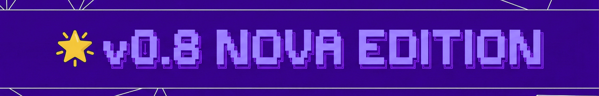

<p align="center">
  
</p>

<p align="center">
  <code>npm i -g codemachine</code>
</p>

<p align="center">
  
</p>

<p align="center">
  <strong>🌟 v0.8 NOVA EDITION is here - a massive update.</strong><br>
  New architecture, breaking changes, and a completely refreshed experience.<br>
  <a href="./docs/changelog.md">See what's changed →</a>
</p>

---

<p align="center">
  <strong>CodeMachine</strong> is a reliable, CLI-native orchestration platform built on coding agents that lets you turn complex coding objectives into repeatable, automated pipelines - with context engineering tools and agent observability - so you can build a workflow once and run it confidently on demand. ⚡️<br></p>

<p align="center">
  
</p>


---

**Coding agents are powerful - until the objectives get repetitive.**

When you're doing the same complex workflow for the 10th time - manually chaining sessions, managing context, rebuilding patterns - you become the bottleneck.

CodeMachine doesn't replace your agents. It orchestrates them.

## Is CodeMachine For You?

**When CodeMachine makes sense:**
- You're doing similar complex workflows repeatedly
- Context management across long objectives is painful
- You want to define once, run many times
- Your team needs consistent, reproducible processes

**When it doesn't:**
- One-off tasks - your coding agent handles those perfectly
- One-time fixes with no repeating pattern
- You prefer manual control of session-by-session work

---

## 🚀 Quick Start

### **Install**

```bash
npm install -g codemachine   # or bun/pnpm/yarn
```

### **Run**

```bash
codemachine   # or cm
```

### **Start**

Hit `/start` and follow the workflow.

That's it.

---

## Why CodeMachine?

*   **Build Once, Run Forever:** Define complex workflows once and execute them reliably on every project - stop rebuilding the same patterns manually.
*   **Multi-Agent Orchestration:** Assign different coding agents to different tasks - use one for planning, another for implementation, another for review.
*   **Parallel Execution:** Run multiple agents simultaneously on different parts of your workflow for faster results.
*   **Long-Running Workflows:** Execute workflows for hours or days - CodeMachine handles persistence so you don't have to babysit.
*   **Context Engineering:** Centralize prompts, manage dynamic context, and control what each agent sees at each step.
*   **Agent Observability:** Trace agent behavior, monitor execution, and refine your workflows with visibility into what's happening.

---

## 🛠️ How It Works

CodeMachine resources live at `~/.codemachine/resources/{version}/` with three core folders:

| Folder | Purpose |
|--------|---------|
| `config/` | Define your agents - who does what |
| `prompts/` | Write instructions - what agents should know |
| `templates/` | Build workflows - how agents work together |

**That's it.** Configure agents, write prompts, connect them in a workflow - then run it whenever you need.

<p align="center">
  <a href="./docs/building-workflows.md"><strong>Learn to build workflows →</strong></a>
</p>

---

## 📦 Workflows

CodeMachine ships with ready-to-use workflows. Pick one, customize it, or build your own.

<p align="center">
<table align="center">
  <thead>
    <tr>
      <th align="left">Workflow</th>
      <th align="left">Description</th>
    </tr>
  </thead>
  <tbody>
    <tr>
      <td><strong><a href="https://github.com/bmad-code-org/BMAD-METHOD">🚀 BMAD</a></strong> <em>(Default)</em></td>
      <td>Breakthrough Method for Agile AI-Driven Development - full project lifecycle from ideation to deployment</td>
    </tr>
    <tr>
      <td><strong><a href="./docs/workflows/codemachine-one.md">⚡ CodeMachine-One</a></strong></td>
      <td>Spec-to-code pipeline - generate code from your specifications</td>
    </tr>
  </tbody>
</table>
</p>

<p align="center">
  <a href="./docs/workflows.md"><strong>Explore all workflows →</strong></a>
</p>

---

## ⚙️ Supported AI Engines

CodeMachine orchestrates CLI-based coding agents. You need at least one installed, and you can use multiple agents in a single workflow.

**Zero config?** If you have OpenCode installed, CodeMachine runs with `glm-4.7-free` by default. For other engines, use `/login` to authenticate.

<p align="center">
<table align="center">
  <thead>
    <tr>
      <th align="left">CLI Engine</th>
      <th align="center">Status</th>
    </tr>
  </thead>
  <tbody>
    <tr><td><strong><a href="https://github.com/openai/codex/">Codex CLI</a></strong></td><td align="center"><code>✓ Supported</code></td></tr>
    <tr><td><strong><a href="https://github.com/anthropics/claude-code">Claude Code</a></strong></td><td align="center"><code>✓ Supported</code></td></tr>
    <tr><td><strong><a href="https://github.com/musistudio/claude-code-router">CCR (Claude Code Router)</a></strong></td><td align="center"><code>✓ Supported</code></td></tr>
    <tr><td><strong><a href="https://github.com/sst/opencode">OpenCode CLI</a></strong></td><td align="center"><code>✓ Supported</code></td></tr>
    <tr><td><strong><a href="https://cursor.com/cli">Cursor CLI</a></strong></td><td align="center"><code>✓ Supported</code></td></tr>
    <tr><td><strong><a href="https://www.augmentcode.com/product/CLI">Auggie CLI</a></strong></td><td align="center"><code>✓ Supported</code></td></tr>
    <tr><td><strong><a href="https://github.com/mistralai/mistral-vibe">Mistral Vibe</a></strong></td><td align="center"><code>✓ Supported</code></td></tr>
  </tbody>
</table>
</p>

<p align="center">
  Can't find your engine listed? <a href="./docs/engines.md"><strong>Check supported engines →</strong></a>
</p>

---

## 🌐 Join the Community

<p align="center">
  Developers are already building with CodeMachine - reducing time and effort on complex, repetitive workflows.<br/>
  <strong>Want to see what they're creating? Join us.</strong>
</p>

<p align="center">
  <a href="https://discord.gg/vS3A5UDNSq">
    
  </a>
  &nbsp;&nbsp;
  <a href="https://www.reddit.com/r/CodeMachine/">
    
  </a>
</p>

---

## ⭐ Contributors

<p align="center">
CodeMachine is built with contributions from amazing developers.<br/>
<strong><a href="./CONTRIBUTORS.md">See all contributors →</a></strong>
</p>

<p align="center">
Found a bug or have a feature idea? Check our <strong><a href="./CONTRIBUTING.md">Contributing Guide</a></strong>.
</p>

---

## 📖 References

<p align="center">
<table align="center">
  <tbody>
    <tr>
      <td align="center">
        <strong><a href="http://docs.codemachine.co/">📚 Documentation</a></strong><br/>
        <sub>Complete guides and CLI reference</sub>
      </td>
      <td align="center">
        <strong><a href="./docs/workflows.md">🔄 Workflows</a></strong><br/>
        <sub>Explore available workflows</sub>
      </td>
      <td align="center">
        <strong><a href="./docs/engines.md">⚙️ Engines</a></strong><br/>
        <sub>Supported coding agents</sub>
      </td>
    </tr>
  </tbody>
</table>
</p>

---
