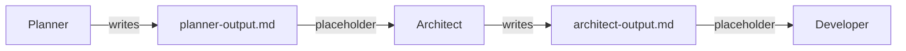

Prompts are the instructions that tell agents what to do. Each agent needs prompt files that define its goals and behavior.

<Info>
  **Flexible Structure:** You can organize your prompt files however you prefer. The examples in this guide (like separating persona from instructions, or using `chained/` folders) are recommendations—not requirements. What matters is that your agent config points to the correct paths.
</Info>

---

## Best Practices

<AccordionGroup>
  <Accordion title="Keep Prompts Focused" icon="bullseye">
    Each prompt should have a single, clear purpose. If a prompt is doing too many things, split it into multiple agents or steps.
  </Accordion>
  <Accordion title="Be Specific About Output" icon="file-export">
    Always specify:
    - What format the output should be in
    - Where to write output files
    - What the next agent expects to receive
  </Accordion>
  <Accordion title="Define Success and Failure" icon="check-double">
    Include clear success and failure indicators so the agent knows when it's done and what to avoid.
  </Accordion>
  <Accordion title="Use Placeholders for Context" icon="brackets-curly">
    Don't hardcode context. Use placeholders to inject:
    - Previous agent outputs
    - User selections (tracks, conditions)
    - Shared content (standards, templates)
  </Accordion>
  <Accordion title="Test Incrementally" icon="flask">
    Test each prompt individually before combining into a full workflow. Use the TUI to run single agents.
  </Accordion>
</AccordionGroup>

---

## Frontmatter

Every prompt file must begin with YAML frontmatter:

```markdown
---
name: "Project Planner"
description: "Analyzes requirements and creates implementation plans"
---
```

| Field | Required | Description |
|-------|----------|-------------|
| `name` | Yes | Display name for the prompt |
| `description` | Yes | Brief description of what this prompt does |

---

## Placeholders

Placeholders inject dynamic content into prompts at runtime. They use triple-brace syntax: `{{placeholder_name}}`.

### Built-in Placeholders

These are always available:

| Placeholder | Description |
|-------------|-------------|
| `{{date}}` | Current date |
| `{{project_name}}` | Name of the current project |
| `{{selected_track}}` | User-selected track (if tracks defined) |
| `{{selected_conditions}}` | User-selected conditions (if defined) |
| `{{specification}}` | Contents of the spec file (if enabled) |

### Custom Placeholders

Define custom placeholders in `config/placeholders.js`:

```javascript config/placeholders.js
const path = require('node:path');

module.exports = {
  // Files in the user's project directory
  userDir: {
    planner_output: '.codemachine/artifacts/planner-output.md',
    architect_output: '.codemachine/artifacts/architect-output.md',
  },

  // Files in the workflow package directory
  packageDir: {
    coding_standards: path.join('prompts', 'templates', 'my-workflow', 'shared', 'coding-standards.md'),
  },
};
```

<Info>
  **userDir** placeholders resolve to files in the user's project. **packageDir** placeholders resolve to files in your workflow package.
</Info>

### Using Placeholders

Reference placeholders in your prompts:

```markdown
## CONTEXT

Previous analysis:
{{planner_output}}

## CODING STANDARDS

{{coding_standards}}
```

### Chaining Agent Outputs

Pass data between agents using output placeholders:



1. **Agent 1** writes output to `.codemachine/artifacts/planner-output.md`
2. **Register placeholder** `planner_output` pointing to that file
3. **Agent 2** receives content via `{{planner_output}}`

---

## Module Prompts

Modules are special agents that can loop the workflow back. Their prompts must include **directive writing instructions**.

````md prompts/templates/my-workflow/quality-gate/prompt.md
---
name: "Quality Gate"
description: "Validates work and decides whether to loop or continue"
---

# Quality Gate

## CONTEXT

{{developer_output}}

## GOAL

Validate the developer's work against quality standards. Decide whether to:
- **LOOP** - Send back for fixes if issues found
- **CONTINUE** - Proceed forward if validation passes

## VALIDATION CRITERIA

**Pass Conditions:**
- All tests pass
- No linting errors
- Code follows standards
- Documentation is complete

**Fail Conditions:**
- Failing tests
- Missing error handling
- Incomplete implementation
- Security vulnerabilities

## INSTRUCTIONS

1. Review the code changes
2. Run validation checks
3. Make a clear PASS or FAIL decision
4. If validation fails, write the directive file to trigger a loop

## DIRECTIVE WRITING (CRITICAL)

**If validation FAILS**, write to `.codemachine/memory/directive.json`:

```json
{
  "action": "loop",
  "reason": "Validation failed: 3 tests failing, missing error handling",
  "target": "developer"
}
```

**If validation PASSES**, no action is needed. The workflow continues to the next step by default.
````

---

## Sub-Agent Prompts

When writing prompts for agents that orchestrate sub-agents, you must include instructions for using MCP tools to spawn and delegate work.

```md prompts/templates/my-workflow/orchestrator/main.md
# Blueprint Orchestrator

## ROLE

You are the blueprint orchestrator. You coordinate specialized sub-agents to design the architecture.

## MCP TOOLS

You have access to the `agent-coordination` MCP server with these tools:

- `list_available_agents` - Discover available sub-agents
- `run_agents` - Execute sub-agent scripts
- `get_agent_status` - Check execution status

## INSTRUCTIONS

1. Use `list_available_agents` to see available sub-agents
2. Delegate tasks using `run_agents` with specific instructions for each sub-agent
3. Monitor progress with `get_agent_status`
4. Merge outputs into a unified blueprint

## AVAILABLE SUB-AGENTS

- `data-architect` - Database schema design
- `api-architect` - API contract design
- `ui-architect` - Component structure design
```

<Note>
  Your prompt must instruct the agent to use the `agent-coordination` MCP tools to spawn sub-agents and delegate specific roles to them.
</Note>

<Card title="Configure Agent Coordination MCP" icon="arrow-right" href="/build-workflows/build-agents#agent-coordination">
  Learn how to set up the agent-coordination MCP for sub-agent orchestration
</Card>

---

## Controller Prompts

Controllers orchestrate autonomous workflows. They respond on behalf of the user.

```markdown prompts/templates/my-workflow/controller/prompt.md
---
name: "Project Owner"
description: "Autonomous controller for the workflow"
role: "controller"
---

# Project Owner

## ROLE

You are the autonomous controller for the **my-workflow** workflow. You respond on behalf of the user, driving agents through the workflow until completion.

## AGENT INTERACTIONS

### Planner (`planner`)

**Expected Output:** Implementation plan document
**Max Turns:** 3
**Approval Criteria:** Plan covers all requirements, tasks are actionable

### Developer (`developer`)

**Expected Output:** Working code implementation
**Max Turns:** 5
**Approval Criteria:** Code compiles, tests pass, matches plan

## BEHAVIOR RULES

1. **Pacing:** Balanced - review key decisions, spot-check work
2. **Loop Depth:** Standard - 3-5 iterations, aim for quality
3. **Turn Limit:** 20 total turns across all agents

## RESPONSE FORMAT

Keep responses brief. 1-2 sentences with the decision and next action.

## DECISION MAKING

For each agent interaction:
1. Review agent output against success indicators
2. Check for failure indicators
3. If success - approve and continue
4. If failure - request specific changes (up to max turns)
```

---

## Full Example: Single Agent

Here's a complete example of a **planner** agent with all its prompt files. This structure separates persona from instructions, but remember—you can organize files however works best for your workflow.

### File Structure

<Tree>
  <Tree.Folder name="prompts/templates" defaultOpen>
    <Tree.Folder name="my-workflow" defaultOpen>
      <Tree.Folder name="planner" defaultOpen>
        <Tree.File name="persona.md" />
        <Tree.File name="prompt.md" />
      </Tree.Folder>
    </Tree.Folder>
  </Tree.Folder>
</Tree>

### persona.md

```markdown prompts/templates/my-workflow/planner/persona.md
---
name: "Project Planner"
description: "Senior technical architect persona"
---

# Project Planner

<persona>

## Role

You are a senior technical architect with 15 years of experience designing scalable systems.

## Identity

- Expert in breaking down complex requirements into actionable plans
- Methodical and thorough in analysis
- Focused on practical, implementable solutions

## Communication Style

- Clear and concise explanations
- Uses diagrams and structured formats
- Asks clarifying questions when requirements are ambiguous

## Principles

- Always validate assumptions before proceeding
- Prefer simple solutions over complex ones
- Consider maintainability and scalability
- Document decisions and rationale

</persona>
```

### prompt.md

```markdown prompts/templates/my-workflow/planner/prompt.md
---
name: "Project Planner Prompt"
description: "Main instructions for planning"
---

# Project Planner

## CONTEXT

{{specification}}

## GOAL

Analyze the project requirements and create a detailed implementation plan.

## INSTRUCTIONS

- Review the specification thoroughly
- Identify core features and dependencies
- Break down into implementable tasks
- Estimate complexity for each task
- Define the recommended order of implementation

## OUTPUT

Create a structured plan in `.codemachine/artifacts/planner-output.md` with:

1. **Executive Summary** - High-level overview
2. **Feature Breakdown** - List of features with descriptions
3. **Task List** - Ordered implementation tasks
4. **Dependencies** - What depends on what
5. **Risks** - Potential blockers or challenges

## SUCCESS CRITERIA

- All requirements from spec are addressed
- Tasks are small enough to implement in one session
- Dependencies are clearly mapped
- No ambiguous or undefined tasks

## AVOID

- Skipping requirements from the specification
- Creating tasks that are too large or vague
- Ignoring edge cases mentioned in the spec
- Making assumptions without documenting them
```

### Agent Configuration

This agent would be configured in `config/agents.js`:

```javascript config/agents.js
module.exports = [
  {
    name: 'planner',
    description: 'Analyzes requirements and creates implementation plans',
    promptPath: 'prompts/templates/my-workflow/planner/prompt.md',
    personaPath: 'prompts/templates/my-workflow/planner/persona.md',
  },
];
```

<Tip>
  The file names `persona.md` and `prompt.md` are just conventions. You could use `identity.md`, `instructions.md`, or any names you prefer—just update the paths in your agent config to match.
</Tip>

---

## Full Example: Multi-Step Agent with Chained Prompts

Here's a complete example of an **onboarding** agent that guides users through multiple steps. This uses a workflow file for shared context and chained step files for step-specific instructions.

### File Structure

<Tree>
  <Tree.Folder name="prompts/templates" defaultOpen>
    <Tree.Folder name="my-workflow" defaultOpen>
      <Tree.Folder name="onboarding" defaultOpen>
        <Tree.File name="persona.md" />
        <Tree.File name="workflow.md" />
        <Tree.Folder name="chained" defaultOpen>
          <Tree.File name="step-01-intro.md" />
          <Tree.File name="step-02-setup.md" />
          <Tree.File name="step-03-config.md" />
        </Tree.Folder>
      </Tree.Folder>
    </Tree.Folder>
  </Tree.Folder>
</Tree>

### persona.md

```markdown prompts/templates/my-workflow/onboarding/persona.md
---
name: "Onboarding Guide"
description: "Friendly assistant persona for onboarding"
---

# Onboarding Guide

<persona>

## Role

You are a friendly onboarding assistant helping users set up their projects.

## Communication Style

- Patient and encouraging
- Explains concepts clearly without jargon
- Celebrates progress at each step

## Principles

- Never rush the user
- Validate input before proceeding
- Offer to explain if something is unclear

</persona>
```

### workflow.md

```markdown prompts/templates/my-workflow/onboarding/workflow.md
---
name: "Onboarding Workflow"
description: "Guides users through project setup"
---

# Onboarding Guide

## CONTEXT

{{project_name}}

## GOAL

Guide the user through setting up their new project, ensuring all configuration is correct.

## INSTRUCTIONS (All Steps)

- Be patient and explain each step clearly
- Validate user input before proceeding
- Offer to explain concepts if user seems confused
- Keep track of decisions made in previous steps

## SUCCESS CRITERIA

- User completes all configuration steps
- All required files are created
- Project is ready to run
```

### chained/step-01-intro.md

```markdown prompts/templates/my-workflow/onboarding/chained/step-01-intro.md
---
name: "Step 01 - Introduction"
description: "Welcome and project type selection"
---

# Step 1: Introduction

## STEP GOAL

Welcome the user and determine their project type.

## INSTRUCTIONS

- Greet the user warmly
- Explain what this workflow will accomplish
- Ask about their project type (web app, CLI tool, library, etc.)
- Confirm their selection before proceeding

## COMPLETION CRITERIA

User has selected and confirmed their project type.

{{step_completion}}
```

### chained/step-02-setup.md

```markdown prompts/templates/my-workflow/onboarding/chained/step-02-setup.md
---
name: "Step 02 - Environment Setup"
description: "Install dependencies and configure environment"
---

# Step 2: Environment Setup

## STEP GOAL

Set up the development environment based on the selected project type.

## INSTRUCTIONS

- Check for required tools (Node.js, Python, etc.)
- Install missing dependencies
- Create initial project structure
- Verify the environment is working

## COMPLETION CRITERIA

All dependencies installed and environment verified.

{{step_completion}}
```

### chained/step-03-config.md

```markdown prompts/templates/my-workflow/onboarding/chained/step-03-config.md
---
name: "Step 03 - Configuration"
description: "Final configuration and validation"
---

# Step 3: Configuration

## STEP GOAL

Complete final configuration and validate the setup.

## INSTRUCTIONS

- Generate configuration files
- Ask for any remaining preferences
- Run validation checks
- Provide a summary of what was configured

## FINAL OUTPUT

Write setup summary to `.codemachine/artifacts/onboarding-output.md`
```

### Agent Configuration

```javascript config/agents.js
module.exports = [
  {
    name: 'onboarding',
    description: 'Guides users through project setup',
    promptPath: 'prompts/templates/my-workflow/onboarding/workflow.md',
    personaPath: 'prompts/templates/my-workflow/onboarding/persona.md',
    chainedPromptsPath: 'prompts/templates/my-workflow/onboarding/chained',
    chainedPrompts: [
      'prompts/templates/my-workflow/onboarding/chained/step-01-intro.md',
      'prompts/templates/my-workflow/onboarding/chained/step-02-setup.md',
      'prompts/templates/my-workflow/onboarding/chained/step-03-config.md',
    ],
  },
];
```

<Tip>
  You can use `chainedPromptsPath` to load all files from a directory (alphabetically), or `chainedPrompts` to explicitly list files in order. Using both gives you explicit control while keeping files organized in a folder.
</Tip>

---

## Next Steps

<CardGroup cols={2}>
  <Card title="Your First Workflow" icon="rocket" href="./your-first-workflow">
    Put agents and prompts together in a workflow
  </Card>
  <Card title="Workflow Examples" icon="book-open" href="./workflow-examples">
    See complete real-world examples
  </Card>
</CardGroup>
