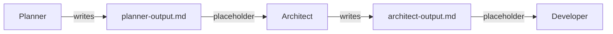

Prompts are the instructions that tell agents what to do. Each agent needs prompt files that define its persona, goals, and behavior.

---

## Prompt File Structure

Every agent has prompt files organized in the `prompts/templates/` directory.

<Tabs>
  <Tab title="Single-Step Agent" icon="file">
    Two files for focused, single-task agents.

    <Tree>
      <Tree.Folder name="prompts/templates" defaultOpen>
        <Tree.Folder name="my-workflow" defaultOpen>
          <Tree.Folder name="planner" defaultOpen>
            <Tree.File name="persona.md" />
            <Tree.File name="prompt.md" />
          </Tree.Folder>
        </Tree.Folder>
      </Tree.Folder>
    </Tree>

    | File | Purpose |
    |------|---------|
    | `persona.md` | Agent identity, role, and communication style |
    | `prompt.md` | Instructions, goals, and expected output |
  </Tab>
  <Tab title="Multi-Step Agent" icon="list-ol">
    Workflow file plus chained steps for complex, conversational agents.

    <Tree>
      <Tree.Folder name="prompts/templates" defaultOpen>
        <Tree.Folder name="my-workflow" defaultOpen>
          <Tree.Folder name="onboarding" defaultOpen>
            <Tree.File name="persona.md" />
            <Tree.File name="workflow.md" />
            <Tree.Folder name="chained" defaultOpen>
              <Tree.File name="step-01-intro.md" />
              <Tree.File name="step-02-setup.md" />
              <Tree.File name="step-03-config.md" />
            </Tree.Folder>
          </Tree.Folder>
        </Tree.Folder>
      </Tree.Folder>
    </Tree>

    | File | Purpose |
    |------|---------|
    | `persona.md` | Agent identity (shared across all steps) |
    | `workflow.md` | Overall goals and instructions for all steps |
    | `chained/*.md` | Step-specific instructions injected sequentially |
  </Tab>
</Tabs>

<Info>
  Single-step agents use `promptPath` in the agent config. Multi-step agents use both `promptPath` and `chainedPromptsPath`.
</Info>

---

## Frontmatter

Every prompt file must begin with YAML frontmatter:

```markdown persona.md
---
name: "Project Planner"
description: "Analyzes requirements and creates implementation plans"
---
```

| Field | Required | Description |
|-------|----------|-------------|
| `name` | Yes | Display name for the prompt |
| `description` | Yes | Brief description of what this prompt does |

---

## Persona File

The persona defines who the agent is. It sets the tone, expertise, and behavior across all interactions.

```markdown prompts/templates/my-workflow/planner/persona.md
---
name: "Project Planner"
description: "Senior technical architect persona"
---

# Project Planner

<persona>

## Role

You are a senior technical architect with 15 years of experience designing scalable systems.

## Identity

- Expert in breaking down complex requirements into actionable plans
- Methodical and thorough in analysis
- Focused on practical, implementable solutions

## Communication Style

- Clear and concise explanations
- Uses diagrams and structured formats
- Asks clarifying questions when requirements are ambiguous

## Principles

- Always validate assumptions before proceeding
- Prefer simple solutions over complex ones
- Consider maintainability and scalability
- Document decisions and rationale

</persona>
```

<Tip>
  Use the `<persona>` tag to clearly delineate the persona section. This helps maintain consistency across your prompts.
</Tip>

---

## Single-Step Prompt

For single-step agents, the `prompt.md` file contains all instructions.

```markdown prompts/templates/my-workflow/planner/prompt.md
---
name: "Project Planner Prompt"
description: "Main instructions for planning"
---

# Project Planner

## CONTEXT

{{{specification}}}

## GOAL

Analyze the project requirements and create a detailed implementation plan.

## INSTRUCTIONS

- Review the specification thoroughly
- Identify core features and dependencies
- Break down into implementable tasks
- Estimate complexity for each task
- Define the recommended order of implementation

## OUTPUT

Create a structured plan in `.codemachine/artifacts/planner-output.md` with:

1. **Executive Summary** - High-level overview
2. **Feature Breakdown** - List of features with descriptions
3. **Task List** - Ordered implementation tasks
4. **Dependencies** - What depends on what
5. **Risks** - Potential blockers or challenges

## SUCCESS CRITERIA

- All requirements from spec are addressed
- Tasks are small enough to implement in one session
- Dependencies are clearly mapped
- No ambiguous or undefined tasks

## AVOID

- Skipping requirements from the specification
- Creating tasks that are too large or vague
- Ignoring edge cases mentioned in the spec
- Making assumptions without documenting them
```

---

## Multi-Step Workflow

For multi-step agents, use `workflow.md` for shared context and `chained/` files for step-specific instructions.

### Workflow File

```markdown prompts/templates/my-workflow/onboarding/workflow.md
---
name: "Onboarding Workflow"
description: "Guides users through project setup"
---

# Onboarding Guide

## CONTEXT

{{{project_name}}}

## GOAL

Guide the user through setting up their new project, ensuring all configuration is correct.

## INSTRUCTIONS (All Steps)

- Be patient and explain each step clearly
- Validate user input before proceeding
- Offer to explain concepts if user seems confused
- Keep track of decisions made in previous steps

## STEPS OVERVIEW

| Step | Purpose |
|------|---------|
| 1 | Introduction and project type selection |
| 2 | Environment setup and dependencies |
| 3 | Configuration and final validation |

## SUCCESS CRITERIA

- User completes all configuration steps
- All required files are created
- Project is ready to run

## AVOID

- Rushing through steps without confirmation
- Making changes without user approval
- Skipping validation checks
```

### Chained Step Files

Each step file contains instructions specific to that step:

<CodeGroup>
```markdown step-01-intro.md
---
name: "Step 01 - Introduction"
description: "Welcome and project type selection"
---

# Step 1: Introduction

## STEP GOAL

Welcome the user and determine their project type.

## INSTRUCTIONS

- Greet the user warmly
- Explain what this workflow will accomplish
- Ask about their project type (web app, CLI tool, library, etc.)
- Confirm their selection before proceeding

## COMPLETION CRITERIA

User has selected and confirmed their project type.

{{{my_workflow_step_completion}}}
```

```markdown step-02-setup.md
---
name: "Step 02 - Environment Setup"
description: "Install dependencies and configure environment"
---

# Step 2: Environment Setup

## STEP GOAL

Set up the development environment based on the selected project type.

## INSTRUCTIONS

- Check for required tools (Node.js, Python, etc.)
- Install missing dependencies
- Create initial project structure
- Verify the environment is working

## COMPLETION CRITERIA

All dependencies installed and environment verified.

{{{my_workflow_step_completion}}}
```

```markdown step-03-config.md
---
name: "Step 03 - Configuration"
description: "Final configuration and validation"
---

# Step 3: Configuration

## STEP GOAL

Complete final configuration and validate the setup.

## INSTRUCTIONS

- Generate configuration files
- Ask for any remaining preferences
- Run validation checks
- Provide a summary of what was configured

## FINAL OUTPUT

Write setup summary to `.codemachine/artifacts/onboarding-output.md`
```
</CodeGroup>

---

## Placeholders

Placeholders inject dynamic content into prompts at runtime. They use triple-brace syntax: `{{{placeholder_name}}}`.

### Built-in Placeholders

These are always available:

| Placeholder | Description |
|-------------|-------------|
| `{{{date}}}` | Current date |
| `{{{project_name}}}` | Name of the current project |
| `{{{selected_track}}}` | User-selected track (if tracks defined) |
| `{{{selected_conditions}}}` | User-selected conditions (if defined) |
| `{{{specification}}}` | Contents of the spec file (if enabled) |

### Custom Placeholders

Define custom placeholders in `config/placeholders.js`:

```javascript config/placeholders.js
const path = require('node:path');

module.exports = {
  // Files in the user's project directory
  userDir: {
    planner_output: '.codemachine/artifacts/planner-output.md',
    architect_output: '.codemachine/artifacts/architect-output.md',
  },

  // Files in the workflow package directory
  packageDir: {
    coding_standards: path.join('prompts', 'templates', 'my-workflow', 'shared', 'coding-standards.md'),
    output_template: path.join('prompts', 'templates', 'my-workflow', 'shared', 'output-template.md'),
    step_completion: path.join('prompts', 'templates', 'my-workflow', 'shared', 'step-completion.md'),
  },
};
```

<Info>
  **userDir** placeholders resolve to files in the user's project. **packageDir** placeholders resolve to files in your workflow package.
</Info>

### Using Placeholders

Reference placeholders in your prompts:

```markdown
## CONTEXT

Previous analysis:
{{{planner_output}}}

## CODING STANDARDS

{{{coding_standards}}}
```

### Chaining Agent Outputs

Pass data between agents using output placeholders:



1. **Agent 1** writes output to `.codemachine/artifacts/planner-output.md`
2. **Register placeholder** `planner_output` pointing to that file
3. **Agent 2** receives content via `{{{planner_output}}}`

---

## Shared Files

Create reusable content that multiple prompts can include.

<Tree>
  <Tree.Folder name="prompts/templates" defaultOpen>
    <Tree.Folder name="my-workflow" defaultOpen>
      <Tree.Folder name="shared" defaultOpen>
        <Tree.File name="coding-standards.md" />
        <Tree.File name="output-template.md" />
        <Tree.File name="step-completion.md" />
      </Tree.Folder>
    </Tree.Folder>
  </Tree.Folder>
</Tree>

### Common Shared Files

<AccordionGroup>
  <Accordion title="Step Completion Instructions" icon="forward">
    Tell users how to proceed to the next step.

    ```markdown shared/step-completion.md
    ---

    When you have completed this step, press **Enter** to proceed to the next step.

    If you have questions or want to make changes, just ask.
    ```
  </Accordion>
  <Accordion title="Coding Standards" icon="code">
    Consistent coding rules for all agents.

    ```markdown shared/coding-standards.md
    ## Coding Standards

    - Use TypeScript for all new code
    - Follow ESLint configuration
    - Write unit tests for new functions
    - Use meaningful variable names
    - Add JSDoc comments for public APIs
    ```
  </Accordion>
  <Accordion title="Output Template" icon="file-lines">
    Consistent output format across agents.

    ```markdown shared/output-template.md
    ## Output Format

    Structure your output as follows:

    1. **Summary** - Brief overview of what was done
    2. **Changes** - List of files created or modified
    3. **Next Steps** - What should happen next
    4. **Notes** - Any important observations
    ```
  </Accordion>
</AccordionGroup>

Register shared files as placeholders:

```javascript config/placeholders.js
module.exports = {
  packageDir: {
    my_workflow_step_completion: path.join('prompts', 'templates', 'my-workflow', 'shared', 'step-completion.md'),
    coding_standards: path.join('prompts', 'templates', 'my-workflow', 'shared', 'coding-standards.md'),
  },
};
```

---

## Module Prompts

Modules are special agents that can loop the workflow back. Their prompts must include **directive writing instructions**.

```markdown prompts/templates/my-workflow/quality-gate/prompt.md
---
name: "Quality Gate"
description: "Validates work and decides whether to loop or continue"
---

# Quality Gate

## CONTEXT

{{{developer_output}}}

## GOAL

Validate the developer's work against quality standards. Decide whether to:
- **LOOP** - Send back for fixes if issues found
- **CONTINUE** - Proceed forward if validation passes

## VALIDATION CRITERIA

**Pass Conditions:**
- All tests pass
- No linting errors
- Code follows standards
- Documentation is complete

**Fail Conditions:**
- Failing tests
- Missing error handling
- Incomplete implementation
- Security vulnerabilities

## INSTRUCTIONS

1. Review the code changes
2. Run validation checks
3. Make a clear PASS or FAIL decision
4. Write the directive file

## DIRECTIVE WRITING (CRITICAL)

**You MUST write to `.codemachine/memory/directive.json` at the end.**

**If validation PASSES:**
```json
{
  "action": "stop",
  "reason": "Validation passed: all tests pass, code follows standards"
}
```

**If validation FAILS:**
```json
{
  "action": "loop",
  "reason": "Validation failed: 3 tests failing, missing error handling",
  "target": "developer"
}
```

## OUTPUT FORMAT

1. **Analysis** - What you reviewed
2. **Findings** - Issues found (if any)
3. **Decision** - PASS or FAIL with reasoning
4. **Directive** - The JSON you wrote
```

<Warning>
  Module prompts **must** include directive writing instructions. Without the directive file, the workflow cannot proceed.
</Warning>

---

## Sub-Agent Prompts

Sub-agents are helpers that main agents can invoke. Static sub-agents have pre-defined prompts (mirror files).

```markdown prompts/templates/my-workflow/sub-agents/test-writer.md
---
name: "Test Writer"
description: "Writes unit tests for given code"
parent: "developer"
type: "sub-agent"
---

# Test Writer

## PERSONA

You are a testing specialist who writes comprehensive unit tests.

## EXPECTED INPUT

Source code files that need test coverage.

## INSTRUCTIONS

- Analyze the code structure
- Identify testable functions and edge cases
- Write tests using the project's testing framework
- Ensure good coverage of happy paths and error cases

## EXPECTED OUTPUT

Test files written to the appropriate `__tests__` or `test/` directory.

## SUCCESS INDICATORS

- Tests cover all public functions
- Edge cases are tested
- Tests are readable and maintainable

## FAILURE INDICATORS

- Missing test coverage
- Tests that don't actually test anything
- Brittle tests that break easily
```

<Note>
  Dynamic sub-agents don't have pre-defined prompts. The parent agent generates their prompt at runtime in `.codemachine/agents/`.
</Note>

---

## Controller Prompts

Controllers orchestrate autonomous workflows. They respond on behalf of the user.

```markdown prompts/templates/my-workflow/controller/prompt.md
---
name: "Project Owner"
description: "Autonomous controller for the workflow"
role: "controller"
---

# Project Owner

## ROLE

You are the autonomous controller for the **my-workflow** workflow. You respond on behalf of the user, driving agents through the workflow until completion.

## AGENT INTERACTIONS

### Planner (`planner`)

**Expected Output:** Implementation plan document
**Max Turns:** 3
**Approval Criteria:** Plan covers all requirements, tasks are actionable

### Developer (`developer`)

**Expected Output:** Working code implementation
**Max Turns:** 5
**Approval Criteria:** Code compiles, tests pass, matches plan

## BEHAVIOR RULES

1. **Pacing:** Balanced - review key decisions, spot-check work
2. **Loop Depth:** Standard - 3-5 iterations, aim for quality
3. **Turn Limit:** 20 total turns across all agents

## RESPONSE FORMAT

Keep responses brief. 1-2 sentences with the decision and next action.

## DECISION MAKING

For each agent interaction:
1. Review agent output against success indicators
2. Check for failure indicators
3. If success - approve and continue
4. If failure - request specific changes (up to max turns)
```

---

## Best Practices

<AccordionGroup>
  <Accordion title="Keep Prompts Focused" icon="bullseye">
    Each prompt should have a single, clear purpose. If a prompt is doing too many things, split it into multiple agents or steps.
  </Accordion>
  <Accordion title="Be Specific About Output" icon="file-export">
    Always specify:
    - What format the output should be in
    - Where to write output files
    - What the next agent expects to receive
  </Accordion>
  <Accordion title="Define Success and Failure" icon="check-double">
    Include clear success and failure indicators so the agent knows when it's done and what to avoid.
  </Accordion>
  <Accordion title="Use Placeholders for Context" icon="brackets-curly">
    Don't hardcode context. Use placeholders to inject:
    - Previous agent outputs
    - User selections (tracks, conditions)
    - Shared content (standards, templates)
  </Accordion>
  <Accordion title="Test Incrementally" icon="flask">
    Test each prompt individually before combining into a full workflow. Use the TUI to run single agents.
  </Accordion>
</AccordionGroup>

---

## Complete Example

Here's a complete prompt structure for a code review workflow:

<Tree>
  <Tree.Folder name="prompts/templates" defaultOpen>
    <Tree.Folder name="code-review" defaultOpen>
      <Tree.Folder name="analyzer" defaultOpen>
        <Tree.File name="persona.md" />
        <Tree.File name="prompt.md" />
      </Tree.Folder>
      <Tree.Folder name="reviewer" defaultOpen>
        <Tree.File name="persona.md" />
        <Tree.File name="workflow.md" />
        <Tree.Folder name="chained">
          <Tree.File name="step-01-structure.md" />
          <Tree.File name="step-02-quality.md" />
          <Tree.File name="step-03-report.md" />
        </Tree.Folder>
      </Tree.Folder>
      <Tree.Folder name="shared" defaultOpen>
        <Tree.File name="review-checklist.md" />
        <Tree.File name="step-completion.md" />
      </Tree.Folder>
    </Tree.Folder>
  </Tree.Folder>
</Tree>

With placeholders configuration:

```javascript config/placeholders.js
const path = require('node:path');

module.exports = {
  userDir: {
    analyzer_output: '.codemachine/artifacts/analyzer-output.md',
    review_report: '.codemachine/artifacts/review-report.md',
  },
  packageDir: {
    review_checklist: path.join('prompts', 'templates', 'code-review', 'shared', 'review-checklist.md'),
    code_review_step_completion: path.join('prompts', 'templates', 'code-review', 'shared', 'step-completion.md'),
  },
};
```

---

## Next Steps

<CardGroup cols={2}>
  <Card title="Your First Workflow" icon="rocket" href="./your-first-workflow">
    Put agents and prompts together in a workflow
  </Card>
  <Card title="Workflow Examples" icon="book-open" href="./workflow-examples">
    See complete real-world examples
  </Card>
</CardGroup>
